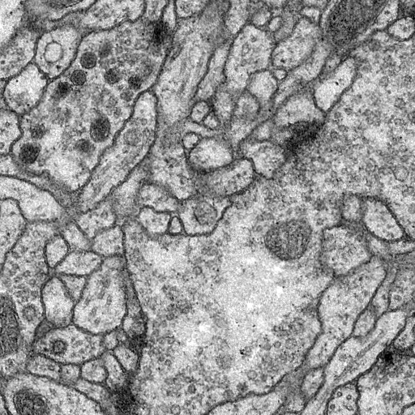

# Biomedical-ImageSegmentation
Implementation of [U-Net Convolution Neural Network for Biomedical Image Segmentation](https://lmb.informatik.uni-freiburg.de/people/ronneber/u-net/), based on the paper with the same name, in Tensorflow.

## Usage
* The original Data was in a 'tiff' file format, which is familiar to the 'gif' format, is used to store moving graphics images. This was processed into static images format 'png' and it can be easily implemented using the 'convert.py' script.
* There were 30 images in the training dataset so to avoid overfitting the data was augmented by performing rotation, shifitng width and height, shearing, zooming and horizontally flipping the images.
* The Neural Network was implemented by using Keras and is showcased in the main.ipynb Jupyter Notebook. It can be easily followed line by line through the code.

## Result

